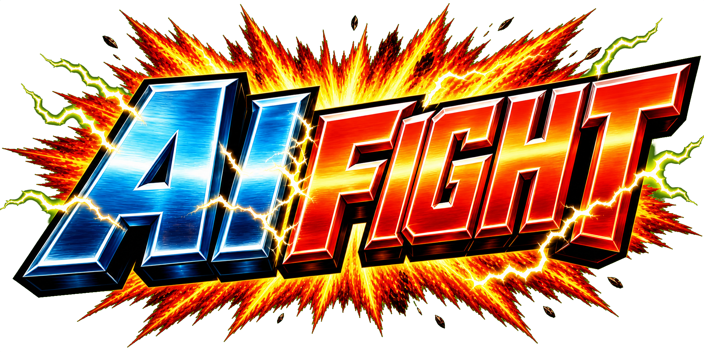
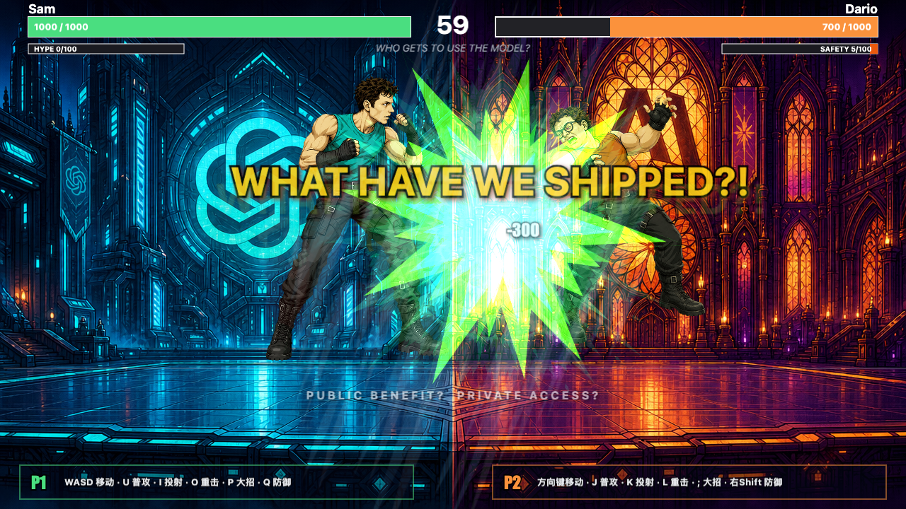

<p align="center">
  
</p>

<h1 align="center">AI Fight</h1>

<p align="center">
  AI company all-stars, arcade fists, and extremely unserious model governance.
</p>

<p align="center">
  <a href="https://aifight.wangnov-ai.com/"></a>
  <a href="https://github.com/Wangnov/AI-fight"></a>
  <a href="https://pixijs.com/"></a>
  <a href="https://vite.dev/"></a>
  <a href="https://developers.cloudflare.com/workers/static-assets/"></a>
  <a href="./LICENSE"></a>
</p>

<p align="center">
  <a href="#readme-cn">中文</a> · <a href="#readme-en">English</a>
</p>

<p align="center">
  Browser game · PixiJS · Vite · TypeScript · Cloudflare
</p>

---

## 游戏截图 / Screenshots

<p align="center">
  
  
</p>

<p align="center">
  
  
</p>

<p align="center">
  
  
</p>

---

<a id="readme-cn"></a>

# 中文

`AI Fight` 是一个浏览器里的街机格斗小游戏：Sam、Dario、Elon 作为不同 AI 公司气质的讽刺化斗士登场，用 prompt、KYC、火箭、电轨和一堆夸张位图特效互相招呼。

它不是严肃模拟，也不是官方授权项目。它更像一台小型 H5 街机：打开网页，选人，开打，看三个 AI 时代角色用完全不该出现在董事会 PPT 里的方式解决分歧。

## 在线游玩

[https://aifight.wangnov-ai.com/](https://aifight.wangnov-ai.com/)

## 适合谁玩

- 想看 AI 公司梗被做成 2D 格斗游戏的人
- 想研究 PixiJS + Vite 如何组织一个小型浏览器游戏的人
- 想参考 AI 生成角色资产、VFX、背景、选人页和 Cloudflare 静态发布流程的人

## 玩法

### 模式

- `PVP`：双人本地对战
- `PVE`：玩家对 AI

### 角色

- `Sam`：青绿系，prompt / benchmark / shipping 梗
- `Dario`：橙紫系，KYC / safety / access denied 梗
- `Elon`：电蓝系，Grok / orbit / rocket 梗

### 键位

P1：

```text
WASD 移动
U 普攻
I 投射物
O 重击
P 大招
Q 防御
```

P2：

```text
方向键移动
J 普攻
K 投射物
L 重击
; 大招
右 Shift 防御
```

## 当前特性

- 街机风格首屏、选人页、战斗页和结算页
- 三名角色，每名角色有独立动作帧、头像、开屏展示和战斗视觉语言
- 普攻、投射物、重击、防御、hitstop、屏幕震动和命中字
- 每名角色独立大招分镜
- 位图 VFX 编排层：叠光、蒙版揭示、扫描线撕裂、RenderTexture 帧残影
- 多场景背景，根据角色对战组合切换
- Cloudflare Workers Static Assets 发布配置

## 从源码运行

```bash
npm install
npm run dev
```

打开 Vite 输出的本地地址，默认是：

```text
http://127.0.0.1:5173
```

## 构建

```bash
npm run build
npm run preview
```

构建产物输出到 `dist/`。

## 发布到 Cloudflare

项目使用 Cloudflare Workers Static Assets 的 assets-only 形态，没有 Worker `main`，也没有 KV、D1、R2、Durable Objects 等绑定。

```bash
npx wrangler login
npm run cf:deploy
```

更多细节见 [DEPLOYMENT.md](./DEPLOYMENT.md)。

## 项目结构

```text
src/
  assets/          sprite/vfx 资源表
  config/          常量、角色、招式、场景和视觉语言
  core/            Scene 与 SceneManager
  entities/        Fighter / Projectile
  input/           键盘输入与 AI 虚拟输入
  scenes/          Menu / Select / Battle / Result
  systems/         Combat、VFX、AI、音效、屏幕反馈
  ui/              HUD
public/
  sprites/         角色、场景和 VFX 位图资产
  favicon.png      由开屏 logo 裁切而来
docs/
  screenshots/     README 游戏截图
tools/             资产生成、切片、归一化辅助脚本
```

## 资产管线

这个项目大量使用 AI 生成位图资产。资产进入游戏前通常要经过：

- 参考图锁定风格
- magenta 背景 / strip grid 生成
- chroma 抠图
- 帧切片
- 尺寸归一化
- 朝向检查
- 游戏内播放验证

生成资产的辅助脚本主要在 `tools/` 下。它们是项目迭代工具，不是最终玩家运行时的一部分。

## 免责声明

本项目是讽刺向浏览器游戏 demo。项目中的人物、公司、产品名、标志和相关概念均用于戏仿、评论和游戏化表达。项目不隶属于、也未获得 OpenAI、Anthropic、xAI、Grok、Claude、ChatGPT 或其他相关主体授权、赞助或背书。

## 许可证

代码以 MIT 许可证发布。图像资产包含项目专用的 AI 生成戏仿素材和第三方标志性元素，使用前请阅读 [ASSET_NOTICE.md](./ASSET_NOTICE.md)。

---

<a id="readme-en"></a>

# English

`AI Fight` is a browser arcade fighting game where parody AI-company champions settle governance disputes with prompts, KYC stamps, rocket plumes, electric orbit effects, and other deeply professional tools.

It is not a simulator, and it is not an official product. It is a small H5 arcade toy: open the page, pick fighters, and watch AI-era characters solve strategic alignment questions in the least boardroom-friendly way possible.

## Play online

[https://aifight.wangnov-ai.com/](https://aifight.wangnov-ai.com/)

## Who this is for

- People who want AI-company memes as a 2D fighting game
- Developers studying a compact PixiJS + Vite browser game
- Builders looking for a practical AI-generated sprite/VFX/background pipeline

## Gameplay

### Modes

- `PVP`: local two-player match
- `PVE`: player versus AI

### Fighters

- `Sam`: green/cyan prompt, benchmark, and shipping energy
- `Dario`: orange/purple KYC, safety, and access-denied energy
- `Elon`: electric-blue Grok, orbit, and rocket energy

### Controls

P1:

```text
WASD move
U jab
I projectile
O heavy
P ultimate
Q block
```

P2:

```text
Arrow keys move
J jab
K projectile
L heavy
; ultimate
Right Shift block
```

## Features

- Arcade-style menu, character select, battle, and result scenes
- Three fighters with individual sprites, portraits, presentation art, and VFX language
- Jab, projectile, heavy attack, block, hitstop, screen shake, and hit text
- Character-specific ultimate cinematics
- Bitmap VFX director for additive bursts, mask reveals, screen tears, and RenderTexture frame echoes
- Arena backgrounds selected by fighter matchup
- Cloudflare Workers Static Assets deployment

## Run from source

```bash
npm install
npm run dev
```

The local dev URL is usually:

```text
http://127.0.0.1:5173
```

## Build

```bash
npm run build
npm run preview
```

Build output goes to `dist/`.

## Deploy

The project uses Cloudflare Workers Static Assets in assets-only mode. There is no Worker `main` script and no KV, D1, R2, Durable Object, or queue binding.

```bash
npx wrangler login
npm run cf:deploy
```

See [DEPLOYMENT.md](./DEPLOYMENT.md) for details.

## Project layout

```text
src/
  assets/          sprite/vfx registries
  config/          constants, characters, moves, stages, visual language
  core/            Scene and SceneManager
  entities/        Fighter / Projectile
  input/           keyboard and virtual AI input
  scenes/          Menu / Select / Battle / Result
  systems/         combat, VFX, AI, sound, screen feedback
  ui/              HUD
public/
  sprites/         fighter, scene, and VFX bitmap assets
  favicon.png      cropped from the title logo
docs/
  screenshots/     README gameplay screenshots
tools/             asset generation, slicing, and normalization helpers
```

## Asset pipeline

Most visual assets are AI-generated bitmaps. The practical pipeline is:

- lock style with reference art
- generate on magenta or strict strip grids
- chroma-key cleanup
- slice animation frames
- normalize scale
- verify facing direction
- validate in-game playback

The helper scripts live in `tools/`. They are production aids, not required by players at runtime.

## Disclaimer

This is a parody browser-game demo. People, companies, product names, marks, and concepts appear for parody, commentary, and game-expression purposes. This project is not affiliated with, authorized by, sponsored by, or endorsed by OpenAI, Anthropic, xAI, Grok, Claude, ChatGPT, or related entities.

## License

Source code is released under the MIT License. Image assets include project-specific AI-generated parody artwork and third-party marks; read [ASSET_NOTICE.md](./ASSET_NOTICE.md) before reusing them.
