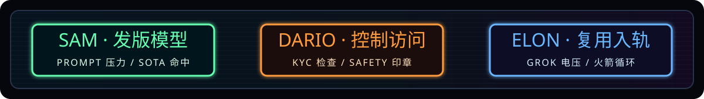
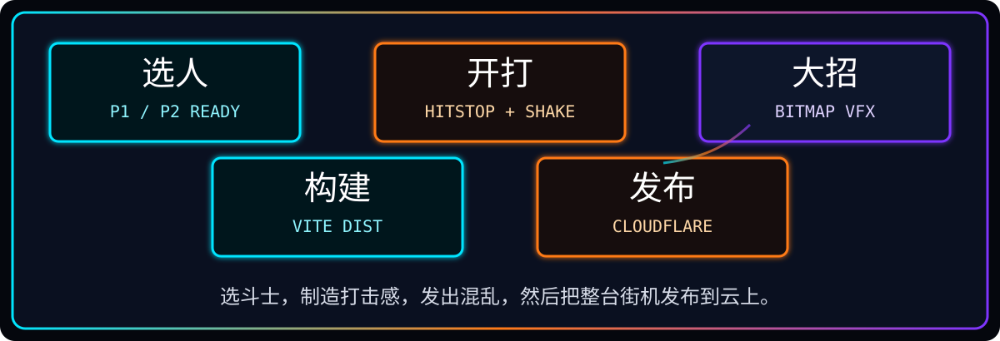
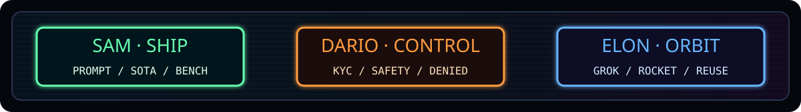

<p align="center">
  
</p>

<p align="center">
  <a href="https://aifight.wangnov-ai.com/"></a>
  <a href="https://github.com/Wangnov/AI-fight"></a>
  <a href="https://pixijs.com/"></a>
  <a href="https://developers.cloudflare.com/workers/static-assets/"></a>
</p>

<p align="center">
  <a href="#readme-cn">中文</a>
  <span> / </span>
  <a href="#readme-en">English</a>
  <span> / </span>
  <a href="./DEPLOYMENT.md">Deploy</a>
  <span> / </span>
  <a href="./ASSET_NOTICE.md">Assets</a>
</p>

<a id="readme-cn"></a>

## 中文

`AI Fight` 是一个浏览器里的街机格斗小游戏：Sam、Dario、Elon 作为不同 AI 公司气质的讽刺化斗士登场，用 prompt、KYC、火箭、电轨和夸张位图特效互相招呼。

### 投币开始

<p align="center">
  
</p>

<p align="center">
  
</p>

<p align="center">
  
</p>

<p align="center">
  <a href="https://aifight.wangnov-ai.com/">
    
  </a>
  
</p>

<p align="center">
  <a href="https://aifight.wangnov-ai.com/"></a>
  <a href="#readme-en"></a>
  <br>
  <sub>首屏街机柜台 / Sam 大招命中循环</sub>
</p>

<p align="center">
  
</p>

### 斗士柜

<p align="center">
  
  
  
</p>

<p align="center">
  <strong>Sam</strong>：Prompt 压力、青绿发版能量、SOTA 命中字。<br>
  <strong>Dario</strong>：访问控制、橙紫安全压力、KYC 印章。<br>
  <strong>Elon</strong>：轨道升级、电蓝 Grok 能量、火箭复用循环。
</p>

### 终结技

<p align="center">
  
  
  
</p>

<p align="center">
  <strong>Sam：</strong>我们到底发了什么？ · <strong>Dario：</strong>你没有被选中。 · <strong>Elon：</strong>复用入轨。
</p>

### 战斗画面

<p align="center">
  
  
</p>

<p align="center">
  <sub>选人页、街机指示器和同角色 P1/P2 表达；命中爆点、伤害字、hitstop 和屏幕冲击。</sub>
</p>

### 玩法

<table>
  <tr>
    <td width="50%"><strong>PVP</strong><br><sub>双人本地对战。</sub></td>
    <td width="50%"><strong>PVE</strong><br><sub>玩家对 AI。</sub></td>
  </tr>
</table>

### 键位

<table>
  <tr>
    <th>P1</th>
    <th>P2</th>
  </tr>
  <tr>
    <td><code>WASD</code> 移动<br><code>U</code> 普攻<br><code>I</code> 投射物<br><code>O</code> 重击<br><code>P</code> 大招<br><code>Q</code> 防御</td>
    <td><code>方向键</code> 移动<br><code>J</code> 普攻<br><code>K</code> 投射物<br><code>L</code> 重击<br><code>;</code> 大招<br><code>右 Shift</code> 防御</td>
  </tr>
</table>

### 当前特性

- 街机风格首屏、选人页、战斗页和结算页
- 三名角色，每名角色有独立动作帧、头像、开屏展示和战斗视觉语言
- 普攻、投射物、重击、防御、hitstop、屏幕震动和命中字
- 每名角色独立大招分镜
- 位图 VFX 编排层：叠光、蒙版揭示、扫描线撕裂、RenderTexture 帧残影
- 多场景背景，根据角色对战组合切换
- Cloudflare Workers Static Assets 发布配置

### 从源码运行

```bash
npm install
npm run dev
```

默认本地地址通常是：

```text
http://127.0.0.1:5173
```

### 构建与发布

```bash
npm run build
npm run preview
npm run cf:deploy
```

项目使用 Cloudflare Workers Static Assets 的 assets-only 形态，没有 Worker `main`，也没有 KV、D1、R2、Durable Objects 等绑定。更多细节见 [DEPLOYMENT.md](./DEPLOYMENT.md)。

### 资产管线

这个项目大量使用 AI 生成位图资产。资产进入游戏前通常要经过参考图锁定、magenta 背景或 strict grid 生成、chroma 抠图、帧切片、尺寸归一化、朝向检查和游戏内播放验证。

<a id="readme-en"></a>

## English

`AI Fight` is a browser arcade fighting game where parody AI-company champions settle governance disputes with prompts, KYC stamps, rocket plumes, electric orbit effects, and other deeply professional tools.

### Insert Coin

<p align="center">
  
</p>

<p align="center">
  
</p>

<p align="center">
  
</p>

<p align="center">
  <a href="https://aifight.wangnov-ai.com/">
    
  </a>
  
</p>

<p align="center">
  <a href="https://aifight.wangnov-ai.com/"></a>
  <a href="#readme-cn"></a>
  <br>
  <sub>Title cabinet / Sam ultimate impact loop</sub>
</p>

<p align="center">
  
</p>

### The Cabinet

<p align="center">
  
  
  
</p>

<p align="center">
  <strong>Sam</strong>: prompt pressure, green/cyan shipping energy, SOTA impact text.<br>
  <strong>Dario</strong>: access control, orange/purple safety pressure, KYC stamps.<br>
  <strong>Elon</strong>: orbital escalation, electric blue Grok energy, rocket reuse loops.
</p>

### Finishers

<p align="center">
  
  
  
</p>

<p align="center">
  <strong>Sam:</strong> What have we shipped? · <strong>Dario:</strong> You were not selected. · <strong>Elon:</strong> Reused to orbit.
</p>

### Battle Shots

<p align="center">
  
  
</p>

<p align="center">
  <sub>Character select, arcade cursor language, same-fighter P1/P2 indicators, impact bursts, damage text, hitstop, and screen punch.</sub>
</p>

### Gameplay

<table>
  <tr>
    <td width="50%"><strong>PVP</strong><br><sub>Local two-player match.</sub></td>
    <td width="50%"><strong>PVE</strong><br><sub>Player versus AI.</sub></td>
  </tr>
</table>

### Controls

<table>
  <tr>
    <th>P1</th>
    <th>P2</th>
  </tr>
  <tr>
    <td><code>WASD</code> move<br><code>U</code> jab<br><code>I</code> projectile<br><code>O</code> heavy<br><code>P</code> ultimate<br><code>Q</code> block</td>
    <td><code>Arrow keys</code> move<br><code>J</code> jab<br><code>K</code> projectile<br><code>L</code> heavy<br><code>;</code> ultimate<br><code>Right Shift</code> block</td>
  </tr>
</table>

### Features

- Arcade-style menu, character select, battle, and result scenes
- Three fighters with individual sprites, portraits, presentation art, and VFX language
- Jab, projectile, heavy attack, block, hitstop, screen shake, and hit text
- Character-specific ultimate cinematics
- Bitmap VFX director for additive bursts, mask reveals, screen tears, and RenderTexture frame echoes
- Arena backgrounds selected by fighter matchup
- Cloudflare Workers Static Assets deployment

<a id="run-from-source"></a>

### Run From Source

```bash
npm install
npm run dev
```

The local dev URL is usually:

```text
http://127.0.0.1:5173
```

### Build And Deploy

```bash
npm run build
npm run preview
npm run cf:deploy
```

See [DEPLOYMENT.md](./DEPLOYMENT.md) for the Cloudflare release path.

### Project Layout

- `src/assets/`: sprite and VFX registries.
- `src/config/`: constants, characters, moves, stages, and visual language.
- `src/scenes/`: menu, select, battle, and result scenes.
- `src/systems/`: combat, VFX, AI, sound, and screen feedback.
- `public/sprites/`: fighter, scene, and VFX bitmap assets.
- `docs/readme/` and `docs/screenshots/`: README presentation assets.
- `tools/`: asset generation, slicing, screenshots, and normalization helpers.

## Notice

This is a parody browser-game demo. People, companies, product names, marks, and concepts appear for parody, commentary, and game-expression purposes. This project is not affiliated with, authorized by, sponsored by, or endorsed by OpenAI, Anthropic, xAI, Grok, Claude, ChatGPT, or related entities.

Source code is released under the MIT License. Image assets include project-specific AI-generated parody artwork and third-party marks; read [ASSET_NOTICE.md](./ASSET_NOTICE.md) before reusing them.

<p align="center">
  
</p>
